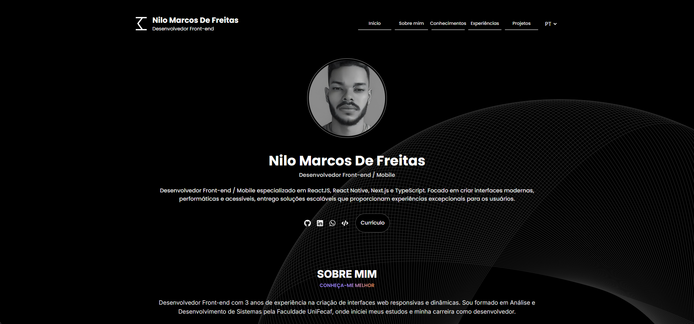
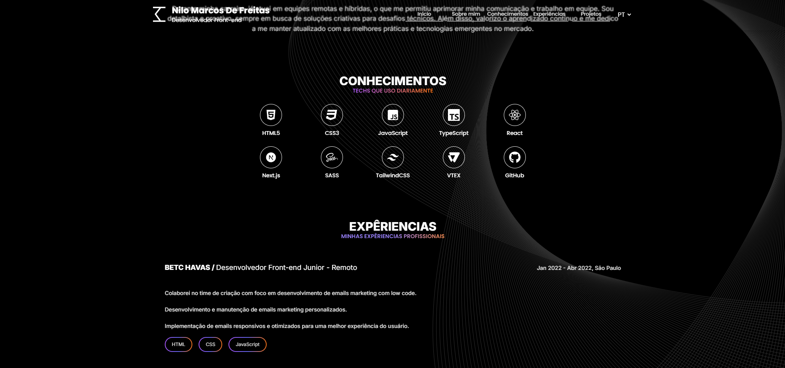
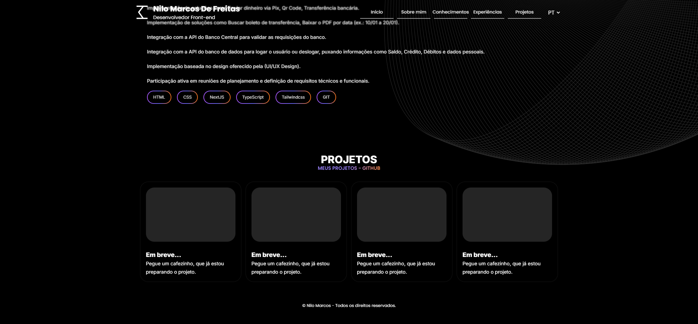

<h1 align="center">Meu portifolio</h1>

<!-- Getting Started -->
# Sobre a aplicação
Este é o meu portfólio, desenvolvido com o objetivo de demonstrar minhas habilidades práticas no desenvolvimento frontend e proporcionar uma experiência interativa para os usuários. A aplicação conta com diversas animações e bibliotecas que tornam o site mais dinâmico e visualmente atraente. Além disso, foquei em usabilidade e a atenção aos detalhes.

### INSTALAÇÃO
1. Clone o repositório

   ```sh
   git clone https://github.com/NiloMarcos/MyPortifolio.git
   ```

2. Entre na pasta

   ```sh
   cd MyPortifolio
   ```

3. Instale as dependências

   ```sh
   yarn
   ```

   ou

   ```sh
   npm i

### Iniciar a aplicação
1. Abra o terminal e rode a aplicação com o seguinte comando
   ```sh
   yarn dev
   ```

### Apresentação da aplicação
<p align="center">

<div>
  
  
  
</div>